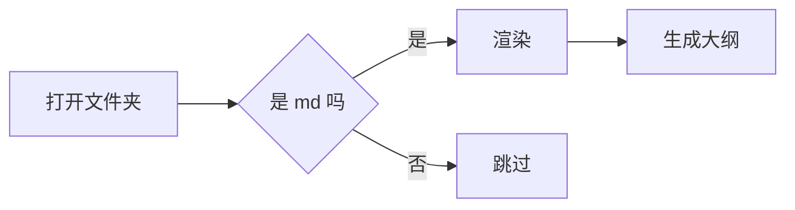

# 功能演示

这是一份用来检验阅读器各项功能的文档。上面灰色那块是 YAML front matter[^fm]。

## 1. 文字排版

普通段落、**加粗**、*斜体*、~~删除线~~、`行内代码`、[外部链接](https://example.com)、
还有[跳到另一篇](./第二篇.md)这样的站内跳转。

> 引用块。
> 支持多行，并且可以嵌套 `代码`。

分隔线：

---

## 2. 列表与任务

- 无序列表
  - 二级
    - 三级
1. 有序列表
2. 第二项

任务清单：

- [x] 渲染 Markdown
- [x] 代码高亮
- [ ] 写一个编辑器（今天不做）

## 3. 表格

| 功能 | 快捷键 | 说明 |
|------|--------|------|
| 侧边栏 | `Ctrl+B` | 收起 / 展开 |
| 查找 | `Ctrl+F` | 文内高亮跳转 |
| 快速跳转 | `Ctrl+K` | 按文件名筛选 |
| 导出 PDF | `Ctrl+P` | 走浏览器打印 |

## 4. 代码块

```python
def fib(n):
    """经典斐波那契"""
    a, b = 0, 1
    for _ in range(n):
        a, b = b, a + b
    return a

print([fib(i) for i in range(10)])
```

```javascript
const sum = arr => arr.reduce((a, b) => a + b, 0);
console.log(sum([1, 2, 3]));  // 6
```

```
没有指定语言的代码块，保持纯文本。
```

## 5. 数学公式

行内公式 $E = mc^2$，以及 $a_1 + a_2 + \cdots + a_n$。

块级公式：

$$
\int_{-\infty}^{\infty} e^{-x^2}\,dx = \sqrt{\pi}
$$

$$\sum_{i=1}^{n} i = \frac{n(n+1)}{2}$$

注意 `$100 和 $200` 这种金额不会被误认成公式。

## 6. Mermaid 图表



## 7. 脚注

正文里写一个引用[^1]，再来一个[^note]。

[^fm]: front matter 会被单独显示，不参与正文渲染。
[^1]: 这是第一条脚注。
[^note]: 脚注支持具名 id，点右边的箭头可以跳回正文。

## 8. 图片


第二张图故意指向不存在的路径，用来验证缺图时的提示。
